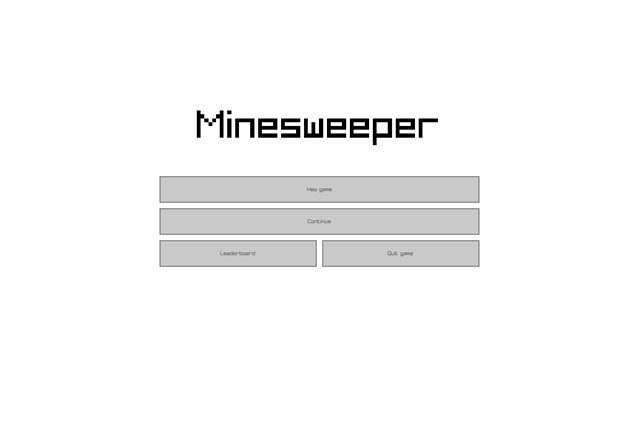
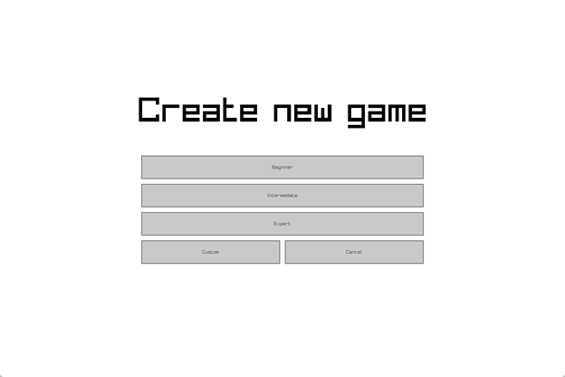
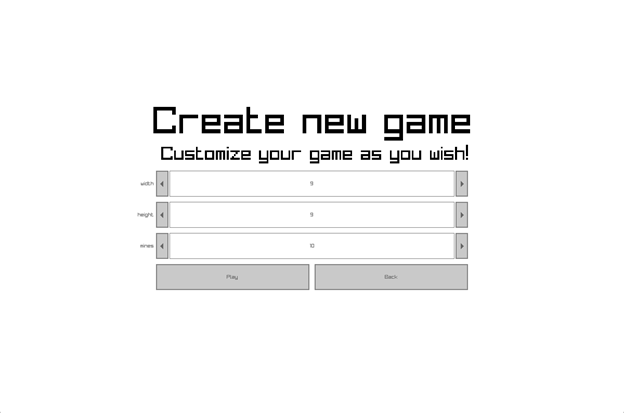
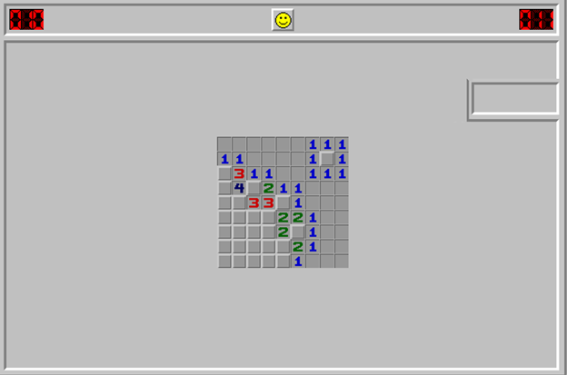
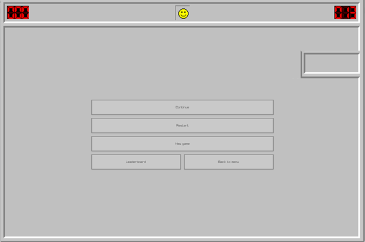
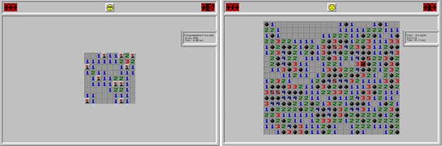
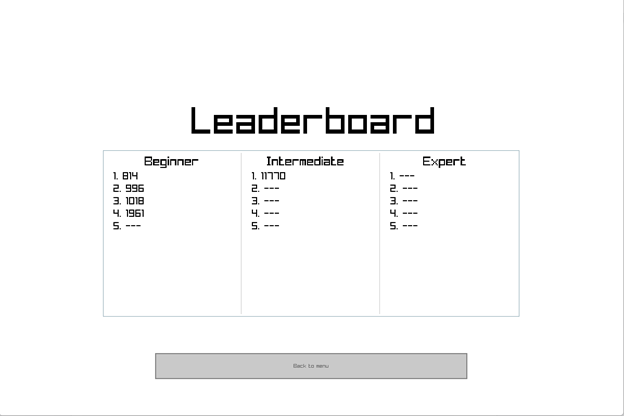

# CS161 Project: Minesweeper

Repository: https://github.com/ntploc21/cs161-minesweeper

C++ project for CS161 Course.

## Introduction
This project is the Minesweeper game written in C++ language. It has almost all of the features of the Minesweeper game on https://minesweeper.online/ and all of the features listed in Final Project Minesweeper (CS161).

## Features
* Drawing the board (including cells, mines and flags).
* Changing the state of each cell when it is selected.
* Timer.
* Randomize positions of the mines.
* Receiving new position of the pointer (to select a cell) with mouse cursor.
* Saving the current state of the board and loading in the next playing session.
* Saving high scores.
* Leaderboard

## Requirements
* C++20 (GNU GCC 11.3.0)
* Mingw 7.3.0 or above
* Raylib
* Raygui (already included in this repo)

## Building
* Clone this repository
* Install Raylib on your platform
* Run the “premake-mingw.bat”
* Open w64devkit, set current directory to be the current project folder and type “make”
* The executable `minesweeper` will be built in the _bin folder

## Contributor
22125050 - Nguyen Thanh Phuoc Loc

ntploc21@gmail.com

https://www.facebook.com/ntploc.21/

## Usage

In the menu screen, there are 4 options:
* New game: start a new game
* Continue: continue from a saved game (if existed)
* Leaderboard: view your highest scores
* Quit game: turn off Minesweeper

In the game mode selection screen, there are 5 options:
* Beginner: start the game in beginner mode (with a 9x9 board and 10 mines)
* Intermediate: start the game in intermediate mode (with a 16x16 board and 40 mines)
* Expert: start the game in expert mode (with a 24x20 board and 99 mines).
* Custom: customize your game by freely choosing the size of the board and the number of mines.
* Cancel: back to the menu screen

In the custom game mode selection, there are 3 modifiable values so you can customize your game in your way:
* width: the width of the game table
* height: the height of the game table
* mines: the number of mines on the game table

In the gameplay screen, it’s the Minesweeper gameplay:
* The game table
* Timer (the counter on the right)
* The number of unknown mines
* A button to open the ingame menu (the smiling face in the middle)

In the ingame menu screen, there are 5 options:
* Continue: continue playing the current game
* Restart: restart the game with the current game option that you’ve previously chose
* New game: save the current game and go to the game selection screen to start a new game
* Leaderboard: view your highest scores
Back to menu: back to the menu screen

The screen on the left is when you win the game, your score will be displayed (and if it is in your top 5 highest scores and the game mode you choose are among beginner, intermediate and expert, it will be saved in the leaderboard) and the smiling face turn to “wicked face”.

The screen on the right is when you lose the game, as you lose, you receive no score.

In the leaderboard screen, there are your highest scores in 3 game modes: Beginner, Intermediate, Expert (the smaller the score, the higher the score will be). Also, you can get back to the menu screen by clicking the button “Back to menu”.

## Video demo
https://youtu.be/Clhi9bk5ZLU
